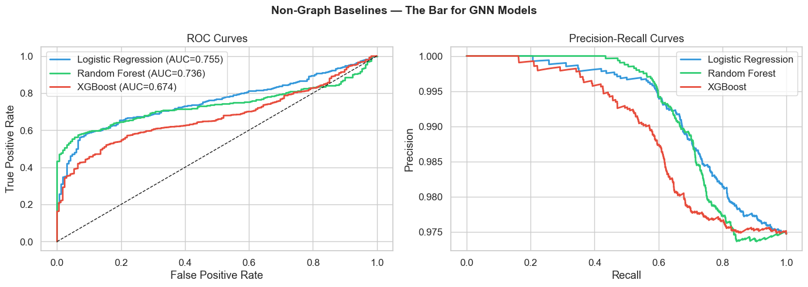
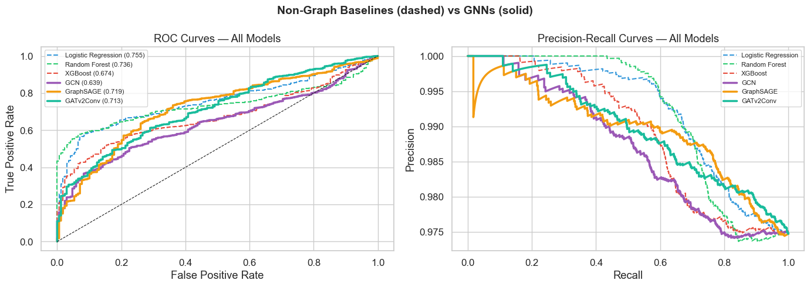

# GraphFraud

[](https://github.com/pgrady1322/graphfraud/actions/workflows/ci.yml)
[](https://www.python.org/downloads/)
[](LICENSE)

**Graph Neural Network Fraud Detection on Financial Transaction Networks**

Detects illicit transactions in Bitcoin/financial networks using GATv2Conv graph attention networks with class-imbalance-aware training. Inspired by graph attention networks build for genomics.

---

## Overview

The inspiration for this project is the vast differences between the applications of machine learning models that explore tree / forest space versus graph models. Although these are both graph-based datasets, the node dimensions are low in a genome graph, and only by exploring the neighboring nodes via the sequence information on the edges can the optimal path be determined. The Elliptic Bitcoin dataset contains nodes that are extremely high dimensional, relatively, with 94 node features, as well as 72 aggregated neighbor features along with a 49 timestamp temporal dimension. Due to this, graph models (GAT2Conv) are much less likely to perform well relative to tree models (XGBoost). This is especially true since only ~23% of this dataset is labeled as licit or illicit transactions, and licit labels outweigh illicit 9:1.

| Component | Description |
|-----------|-------------|
| **Graph Construction** | Build transaction graphs from tabular edge/node data (NetworkX → PyG) |
| **GNN Models** | GATv2Conv, GraphSAGE, GCN — configurable via YAML |
| **Baselines** | XGBoost, Logistic Regression, Random Forest (no graph structure) |
| **Resampling** | Hybrid under/oversampling for extreme class imbalance (~2% illicit) |
| **HP Search** | Optuna with pruning, StratifiedKFold CV |
| **Explainability** | GNNExplainer for transaction-level attribution |
| **CLI** | Click-based pipeline: `graphfraud train`, `graphfraud evaluate`, `graphfraud explain` |

## Dataset

**Elliptic Bitcoin Dataset** — 203k transactions, 234k edges, 49 timesteps.

| Class | Count | % |
|-------|-------|---|
| Licit | 42,019 | 20.7% |
| Illicit | 4,545 | 2.2% |
| Unknown | 157,205 | 77.1% |

> 166 node features (94 local + 72 aggregated neighbor features). Temporal graph with 49 timesteps.

Download: [Kaggle](https://www.kaggle.com/datasets/ellipticco/elliptic-data-set)

## Results / Figures

Full EDA, baseline training, and GNN training are in the [exploration notebook](notebooks/01_eda_and_baselines.ipynb).






## Quick Start

```bash
# Install (CPU-only baselines)
pip install -e .

# Install with GNN support
pip install -e ".[gnn]"

# Install everything
pip install -e ".[all]"

# Download data
graphfraud download --output data/

# Train GATv2 model
graphfraud train --config configs/gatv2.yaml

# Train XGBoost baseline
graphfraud train --config configs/xgboost_baseline.yaml

# Train sklearn baselines
graphfraud train --config configs/logistic_regression.yaml
graphfraud train --config configs/random_forest.yaml

# Evaluate
graphfraud evaluate --model trained_models/gatv2_best.pt --data data/

# Explain predictions
graphfraud explain --model trained_models/gatv2_best.pt --node-id 12345
```

## Project Structure

```
graphfraud/
├── .github/
│   └── workflows/
│       └── ci.yml              # GitHub Actions (lint + core tests, GNN tests)
├── pyproject.toml
├── README.md
├── configs/
│   ├── gatv2.yaml              # GATv2Conv config
│   ├── graphsage.yaml          # GraphSAGE config
│   ├── xgboost_baseline.yaml   # XGBoost (no graph) baseline
│   ├── logistic_regression.yaml  # Logistic Regression baseline
│   └── random_forest.yaml      # Random Forest baseline
├── graphfraud/
│   ├── __init__.py
│   ├── cli.py                  # Click CLI
│   ├── data/
│   │   ├── __init__.py
│   │   ├── dataset.py          # Elliptic dataset loader + PyG conversion
│   │   └── resampling.py       # Hybrid resampling for class imbalance
│   ├── models/
│   │   ├── __init__.py
│   │   ├── gatv2.py            # GATv2Conv classifier
│   │   ├── graphsage.py        # GraphSAGE classifier
│   │   ├── gcn.py              # GCN baseline
│   │   ├── xgboost_baseline.py # Non-graph XGBoost baseline
│   │   └── sklearn_baselines.py  # Logistic Regression + Random Forest
│   ├── training/
│   │   ├── __init__.py
│   │   ├── trainer.py          # Training loop (GNN + sklearn routing)
│   │   ├── hp_search.py        # Optuna HP optimization
│   │   └── evaluation.py       # Metrics, confusion matrix, reports
│   └── explain/
│       ├── __init__.py
│       └── gnn_explainer.py    # GNNExplainer wrapper
├── notebooks/
│   └── 01_eda_and_baselines.ipynb  # EDA + non-graph baseline benchmarks
├── tests/
│   ├── test_dataset.py
│   ├── test_models.py
│   ├── test_resampling.py
│   └── test_sklearn_baselines.py
├── trained_models/             # .pt / .pkl artifacts (gitignored)
├── data/                       # Raw data (gitignored)
└── results/                    # Evaluation outputs (gitignored)
```

## Methods

### Graph Neural Network Architecture

```
Input (166 features/node)
    │
    ├── GATv2Conv (8 heads, 32 dim) + ELU + Dropout
    ├── GATv2Conv (8 heads, 32 dim) + ELU + Dropout
    ├── GATv2Conv (1 head, 64 dim) + ELU
    │
    ├── Global pooling (optional for graph-level tasks)
    │
    └── MLP Head → 2 classes (licit / illicit)
```

### Class Imbalance Strategy
- **Hybrid resampling:** Undersample licit to cap, oversample illicit to median
- **Focal loss:** Down-weight easy examples, focus on hard-to-classify transactions
- **Temporal train/val/test split:** Timesteps 1-34 train, 35-42 val, 43-49 test (no data leakage)

### Feature Standardization

All 166 features are standardized (`StandardScaler`, fit on training nodes only) before training to ensure features of different scales are treated equally by both GNNs and linear models.

### Baselines
| Model | Features | Graph? | Key Params |
|-------|----------|--------|------------|
| Logistic Regression | 166 (standardized) | No | L2, C=1.0, balanced weights |
| Random Forest | 166 (standardized) | No | 300 trees, max_depth=12, balanced weights |
| XGBoost | 166 node features | No | 500 rounds, max_depth=8, hybrid resampled |
| GCN | 166 + graph topology | Yes | 3 layers, 64 hidden |
| GraphSAGE | 166 + sampled neighbors | Yes | 3 layers, 64 hidden |
| GATv2Conv | 166 + attention-weighted neighbors | Yes | 3 layers, 8 heads, 32 dim |

## Key Design Decisions

1. **Temporal split** (not random) — prevents future data leaking into training
2. **Semi-supervised** — use the 157k unlabeled nodes during message passing but only compute loss on labeled nodes
3. **Inductive evaluation** — model must generalize to unseen timesteps
4. **Attention interpretability** — GATv2 attention weights show *which* neighbor transactions influenced the classification

## License

MIT
